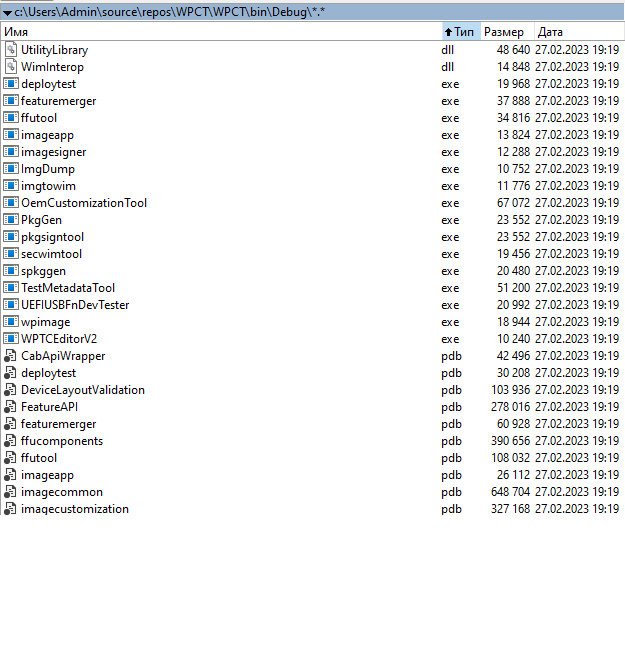

# Windows Phone Common Tools (WPCTools)

My fork of Windows Phone Common Tools created by [Empyreal96](https://github.com/Empyreal96/). 

## About the original

"
Compilable source of most .NET based tools and libraries from the Windows Phone Common Tools package (Windows 10 Kits). 

- Referenced together to allow files to work together (If you use a custom exe with a stock library from the Kits you will get mismatched assembly error)
- I use a different folder to the default settings for my Windows Phone Common Tools install, you may need to reference the location to files from YOUR kit if needed (Only a couple references will need changed)
- Inspired from old decompiled source [IUTools Components Decompiled](https://github.com/Empyreal96/IUTool_components_decompiled)
- Used ILSpy to decompile the binaries
- Targets .NET Framework 4.6 with VS2019


## Libraries:

```
CabApiWrapper
deploytest
DeviceLayoutValidation
FeatureAPI
featuremerger
ffucomponents
ffutool
imageapp
imagecommon
imagecustomization
imagesigner
imagestorageservicemanaged
imaging
ImgDump
ImgToolsCommon
imgtowim
InboxAppLib
LOGUTILS
MCSFOffline
Microsoft.Phone.TestInfra.Deployment
Microsoft.Tools.IO
microsoft.windowsphone.security.securitypolicycompiler
microsoft.windowsphone.security.securitypolicyschema
MVOffline
OemCustomizationTool
PkgBldr.Common
PkgBldr.Plugin.CsiToCsi.Finalize
PkgBldr.Plugin.CsiToPkg.Base
PkgBldr.Plugin.PkgToWm.Base
PkgBldr.Plugin.WmToCsi.Capabilities
PkgBldr.Plugin.WmToCsi.Security
PkgBldr.Tools
PkgCommonManaged
PkgGen
PkgGen.Plugin.InboxApp
PkgGen.Plugin.MCSF
PkgGenCommon
pkgsigntool
PlatformManifest
secwimtool
spkggen
TestMetadataTool
ToolsCommon
UEFIUSBFnDevTester
USB_Test_Infrastructure
UtilityLibrary
WimInterop
wpimage
WPTCEditorV2
```
"


## My 2 cents
- .NET 4.8 used;
- This "external dlls" decompiled and "touched" by me a little:
```
ReflectionUtilities (with Microsoft.MetadataReader namespace)
ufphostm (.net4.8)
Microsoft.Phone.Test.TestMetadata
```

- All results of project compilation will be at ..\bin (at single "common" folder). 




## Status
- A slow researching this cool thing :)


## Credits / Source 
- https://github.com/Empyreal96/
- https://github.com/Empyreal96/WP_Common_Tools


## ..
As is. No support. RnD only.

## .
[m][e] 2023